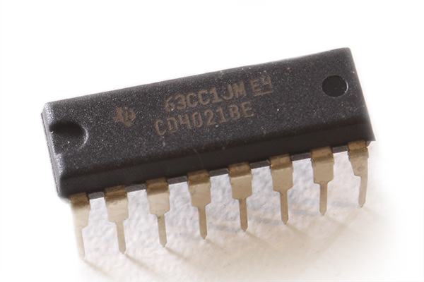

<!--- Copyright (c) 2016 Nic Marcondes -->
Espruino Parallel to Serial Shifting-In with a CD4021BE
=====================

* KEYWORDS: Module,shiftin,CD4021,CD4021BE,HEF4021B,CD4021BMS




Overview
-----------------

This module interfaces with the CD4021BE (also know as HEF4021B), a cheap 8-bit static shift register. They are used in the parallel to serial shifting-in. They also have capability to work in cascading mode without requirement of more Espruino pins to make that work. Support is included in the [[CD4021BE.js]] module.

It's a nice alternative to expand the **IN** possibilities of your Espruino project.

 Key Specifications:

  |                         |       |
  |-------------------------|-------|
  | In ports                | 8     |
  | Can cascading           | Yes   |
  | MCU required pins       | 3     |
  | Communication interface | SPI   |
  | Voltage                 | 3-15V |


Wiring (Example for Espruino Original)
-----------------

  | CD4021BE pin        | Espruino pin      |
  |---------------------|-------------------|
  | 16 (Vcc)            | VBat (5V)         |
  | 8  (GND)            | GND               |
  | 3  (Serial Out)     | B14 (SPI2 - MISO) |
  | 10 (Clock)          | B13 (SPI2 - SCK)  |
  | 9  (Serial Control) | C6  (GPIO)        |

*You can use any other SPI/GPIO available in your Espruino Board. [See in board pin references](http://www.espruino.com/Reference)


Usage
-----------------

call require("CD4021BE").connect(<SPI Number>, <Serial Control Pin>) to get a CD4021BE object. Take use of this object calling read() method. The result will be a array with current status for each port of CD4021BE. 

For example:
```JavaScript
  SPI2.setup({sck: B13, miso: B14, mosi: B15});
  var shift_in = require("CD4021BE").connect(SPI2, C6);
  console.log(shift_in.read()); // [ 0, 0, 0, 0, 0, 1, 0, 0 ] - This means that only port 6 is in high level
```

You can also read lots of CD4021BE in cascading mode, just by passing how many you have as the last connect() param and than call the readAll() method passing a callback function as a param to get the values. The result will be a array of arrays with current status for each ports of each CD4021BE in cascading order.

For example:
```JavaScript
	SPI2.setup({sck: B13, miso: B14, mosi: B15});
	var shift_in = require("CD4021BE").connect(SPI2, C6, 3);
	shift_in.readAll(function(values) {
		console.log(values); // [ [ 0, 0, 0, 0, 0, 0, 0, 1 ], [ 0, 0, 0, 0, 0, 1, 0, 0 ], [ 0, 0, 1, 0, 1, 0, 0, 0 ] ] - The status of three cascading CD4021BE
	});
```


Buying
-----

CD4021BE IC is extremely cheap. This IC can be purchased from many places:
* [eBay](http://www.ebay.com/sch/i.html?_nkw=cd4021)
* [AliExpress](http://www.aliexpress.com/wholesale?SearchText=cd4021)

Reference
---------
* [Technical Data](http://www.nxp.com/documents/data_sheet/HEF4021B.pdf)